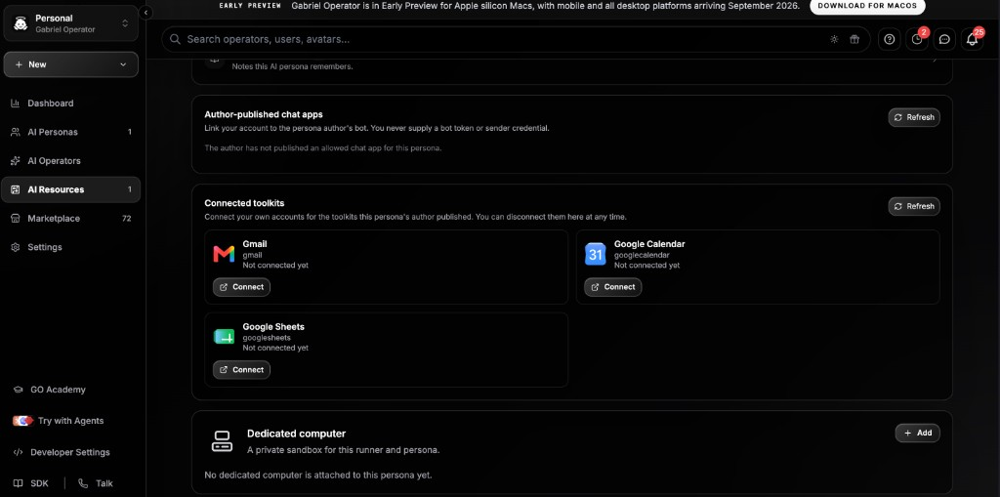

# Persona Builder

## Offline preparation

Read [the embedded runtime contract](references/offline-runtime-v1.md). When offline use is requested, prepare the selected Persona definition, knowledge bytes, playbooks, list/pipeline schemas, schedules, signals, and referenced local files as one authorized dependency bundle. Produce a nested capability report with compatible counts and blocker paths. Keep device model choices, execution ownership, credentials, and secrets outside authored definitions. Distinguish the embedded phone/desktop runtime from the Docker Portable Runtime appliance.

Orchestrator skill for coding agents. Given a workspace `gabi_` token and a
description of what the AI Persona should do, interview the user and create the
full stack through the Gabriel Gateway.

This skill **provisions** resources. After git bindings exist, hand off to
child skills to author the JSON definitions.

This skill ships only from [`Gabriel-Operator/persona-builder`](https://github.com/Gabriel-Operator/persona-builder).
That is the **create-from-scratch** pack.

[`Gabriel-Operator/gabriel-operator-coding-agent-plugin`](https://github.com/Gabriel-Operator/gabriel-operator-coding-agent-plugin)
is the **edit-existing-resources** pack (`workflow-builder`, `list-builder`, `pipeline-builder`, `team-agents`, …).
Installing only that repo does **not** load this interview flow unless `skills/persona-builder` is present.

The gateway bootstrap skill is a third pack:
`npx github:Gabriel-Operator/gabriel-operator-skills add ./gabriel-operator`.

## Using this skill in coding agents

Install **this** pack, then connect MCP. Do not stop after adding the authoring plugin.

| Agent | Install this skill |
|-------|---------|
| **NPX / Cursor / Windsurf** | `npx skills add Gabriel-Operator/persona-builder` |
| **Claude Code** | `/plugin marketplace add Gabriel-Operator/persona-builder` then `/plugin install persona-builder@persona-builder` (bundles the `gabriel` MCP server) |
| **Codex** | `codex plugin marketplace add Gabriel-Operator/persona-builder --sparse .agents/plugins` then install **Persona Builder** |
| **Grok Build** | `grok plugin marketplace add Gabriel-Operator/persona-builder` then `grok plugin install persona-builder --trust` |
| **OpenClaw** | `npx skills add Gabriel-Operator/persona-builder` then `openclaw gateway connect` |
| **Runtime fallback** | MCP `gabriel_get_skill_instructions` with `{ "topic": "persona-builder" }` |
| **Child JSON authoring (after git exists)** | `Gabriel-Operator/gabriel-operator-coding-agent-plugin` |
| **Gabriel Operator monorepo** | `cp -R server/skills/persona-builder ./your-workspace/` |

Required MCP (workspace `gabi_` token).

**Claude Code:** the plugin ships `.mcp.json`, so the `gabriel` server is
configured on install. Only export the token, then start a new session:

```bash
export GABRIEL_TOKEN='gabi_...'
```

See [`gabriel-mcp-setup`](https://github.com/Gabriel-Operator/persona-builder/blob/main/skills/gabriel-mcp-setup/SKILL.md) if the server does not
connect.

**Other agents:** configure it by hand.

```json
{
  "mcpServers": {
    "gabriel": {
      "type": "http",
      "url": "https://gabrieloperator.com/mcp/gateway",
      "headers": {
        "Authorization": "Bearer gabi_<token>"
      }
    }
  }
}
```

Local origin example: `http://localhost:3000/mcp/gateway` (or set
`GABRIEL_MCP_URL` when using the bundled config).

## Authentication

A workspace `gabi_` token is required before any create, publish, or Gateway
work. Read `$GABRIEL_TOKEN` or `$GABI_TOKEN`, or MCP
`Authorization: Bearer gabi_…` on `https://gabrieloperator.com/mcp/gateway`.

Use a **workspace** token (`gabi_…` with no twin binding), MCP Gateway preset:

- `api:access`
- `mcp:access`
- `digital-twin:admin`
- `digital-twin:chat`
- `digital-twin:tools`
- `digital-twin:media`
- `automation:read`
- `automation:run`

Never ask for a password or browser session when this token can perform the
work. Do not print the raw token after it is configured. Do not ask the user
to paste the raw token into chat.

### If the token is missing

Do not start building. Stop and tell the user how to get one:

1. Open https://gabrieloperator.com/signup (or **Sign up** on the homepage).
   First visit creates an account when they sign in.
2. Sign in with email code, Google, Apple, or phone.
3. Open **Workspace → Dashboard** (`/workspace/dashboard`).
4. Top-right pill labeled **Gateway API key**: click copy. The first copy
   mints a Dashboard (MCP Gateway) token that starts with `gabi_`.
5. They will not see the full token again unless they generate a new one.
   Never commit it. Never print it.
6. Connect MCP with that token, or set `GABRIEL_TOKEN` / `GABI_TOKEN`, then
   continue.

If the pill is empty or copy fails: **Generate new key**, or
https://gabrieloperator.com/workspace/developer-settings → **API Tokens** →
**Create New Token** → preset **MCP Gateway**.

Wait until MCP or the env var is actually connected before provisioning.

## Git provisioning (ask once)

Repo create on the **caller's GitHub** (`gabriel_create_git_repository`, `useGithubOAuth: true`) needs a connected GitHub account. A `gabi_` token cannot complete GitHub OAuth. The Edit persona **Create Git repository** default is **Gabriel-managed (internal) Git**, which does not need GitHub.

Before any git create/bind:

1. Call `gabriel_git_provisioning_status`.
2. If `provisioningMode` is `"managed"` — do **not** ask. Call `gabriel_provision_managed_git` for the page, each list, the pipeline, and each slash-command workflow (`kind` + id). That creates **and** binds. Skip `gabriel_create_git_repository` and `gabriel_initialize_*_git` for those resources.
3. If `provisioningMode` is `"own"` — if `githubConnected` is false, stop and send them to `connectGithubUrl` (Developer Settings → Connect GitHub). Wait until they confirm, re-check status, then use `gabriel_create_git_repository` + `initialize_*_git` with `useGithubOAuth: true`.
4. If `needsChoice` is true (`provisioningMode` is null), **ask the user once** and wait. Offer all three:

   - **Gabriel-managed (automated / shared internal Git)** — you create the repos now with no GitHub account. Same as Edit persona → Create Git repository → internal Git.
   - **Their own GitHub** — they connect GitHub at `connectGithubUrl`, then you create repos on that account.
   - **Don't ask again** — they can set **AI Resources setup** at https://gabrieloperator.com/workspace/settings?section=preferences (`Ask me each time` / `Always use internal Git` / `Always use my own GitHub`). If they want you to remember for this chat, call `gabriel_set_git_provisioning_preference` with `managed` or `own` after they choose.

Do not invent a GitHub PAT. Do not ask them to paste a GitHub token into chat.

If `gabriel_create_git_repository` still returns `GITHUB_NOT_CONNECTED`, show `askPrompt` from status (or the Preferences URL) instead of retrying.

## Interview loop

Do not dump a blank page and stop. Collect, propose, confirm, then provision.

1. Confirm the workspace token is available (env or MCP). If it is missing,
   follow **If the token is missing** above and wait. Then run **Git provisioning (ask once)** — do not probe with a throwaway `gabriel_create_git_repository`.
2. Ask what the persona does if the user did not already describe it. Derive a title, short description, slug, and visibility (`private` default). Confirm before creating. Also ask, once, whether they want a custom avatar/banner image now — this is optional and skippable; if they provide or generate one, call `gabriel_upload_asset` to get a hosted URL, then hand it to `digital-twin-page` to set `pageProfile.profilePicture`/`bannerImage`. Do not block persona creation waiting on this.
3. Ask which **input-understanding** modalities the persona needs: Image Understanding, Video Understanding, Audio Understanding, and File Processing. These are independent of generation slash commands (`chatCommandSettings`). New personas default Image Understanding **on** with Gemini API selected; Video, Audio, and File Processing default **off**, also preselected to Gemini API. Patch `multimodalUnderstanding` through `gabriel_update_twin_config`. Store only `enabled`, `provider` (`google` | `openrouter`), and optional opaque `modelId` — never API keys. For `google`, omit `modelId` to reuse one shared saved Gemini API key across image, video, audio, and file (Talk `geminiLiveProviderId`, then File Search `geminiProviderId`, then system default). Direct Gemini key setup to the existing Gemini credential UI; OpenRouter models use the Custom AI Model picker.
4. On every new persona, **always enable Voice Agents with Gemini Live**, **always keep To-Dos off**, and author the authenticated Chat App with `chatApp.experience.sessionMode: "stepper"`. Do not ask; apply the voice/To-Do defaults in the same `gabriel_update_twin_config` patch (and in `assets/chat-config.json`), and author the Chat App through `chat-app-builder`. See **Voice Agents and To-Dos (create defaults)** below. Never enable Checkin Mentor on create. It is not the To-Dos button and not Gemini Talk. Never invoke `todo-builder` or seed todos unless the user later asks.
5. Extract explicit business requirements and unresolved acceptance questions. Propose the data model: which lists (columns), which pipeline/machine (stages + transitions), which operator workflows / slash commands, which disabled Signal starter should accompany each eligible playbook, whether Page Builder event team agents are needed, whether the persona wants a public marketing landing page (`landing-page-builder`) instead of the default plain hero-form chat entry, and what deterministic evidence will prove each outcome. Signal starters are portable drafts only; they never enable monitoring during provisioning. Ask once whether they also want a branded mobile app, desktop app, or both. Branded apps are optional and must not block Persona creation; when requested, collect target platforms and stable identifiers only after the page ID, page slug, Chat App, and branding are known. Confirm the proposal; never silently invent a business acceptance criterion. Localization is not a separate opt-in: every new landing page must enable dynamic translation and IP-country language detection, render the shared language selector visibly in its header at desktop and mobile breakpoints, and preserve the selected language into the authenticated Chat App. Read [Branded Persona mobile and desktop apps](references/persona-apps.md) before authoring or registering an app.
6. Provision in the order below. Create lists and pipelines **before** any config that stores their ids.
7. After git bindings exist, fetch child skill markdown (`gabriel_get_skill_instructions`) and author definitions.
8. Ask separately whether Quality Control and its nested Subscriber simulation should be enabled. Both default off; never infer either opt-in. If subscriber testing is enabled, persist both flags and author every subscriber-facing required case with `runAs: "subscriber"`; otherwise keep cases as author runs and do not create subscriber cases.
9. Author `assets/persona-evals.json`: map every confirmed requirement to typed implementation locators and golden, incomplete-input, adversarial, approval, rejection, and failure scenarios. Validate structure and traceability.
10. Commit and push children first, promote the workspace, validate it, then publish the Git release candidate. Run every required deterministic mock suite against that exact candidate.
11. Repair the repository that owns each failing element, republish the candidate after any change, and rerun. Offer live publication only when Structure, Specification coverage, Functional behavior, and—when enabled—Subscriber experience pass. Live connector smoke tests are optional and never authorize production.
12. Summarize with user-facing names, page URL/slug, candidate SHA, passing author/subscriber eval runs, and what to do next. Do not dump managed actor ids or other internal ids unless asked.

Ask before publishing or minting keys.

## Build order

Gateway REST lives under `https://gabrieloperator.com/api/gateway`. Prefer MCP tools when connected.

1. **Page** — `gabriel_create_page` / `POST /pages` (`title`, `description`, `pageSlug`, `visibility`). Keep `pageId`. The persona operator id is this `pageId`.
2. **Lists** — `gabriel_create_data_list` / `POST /data-lists` with `pageId` and `columns`. Do this before any twin config that names a list. List git is schema only (`runtimeDataPolicy: "definitions_only"`). Never write `data/records.json`.
3. **Pipeline** — `gabriel_create_pipeline` / `POST /pipelines` with `pageId` and `stages`. Then `gabriel_update_pipeline_stages` / `PUT /pipelines/{pipelineId}/stages` with **both** `stages` and `transitions` (create accepts stages but drops transitions; a stages-only update used to wipe transitions and is now rejected). After git is bound, live chat reads git-first with a Mongo fallback. Pushing `assets/pipeline.json` is not enough if git pull fails — call `gabriel_sync_pipeline_from_git`, or `gabriel_update_pipeline_stages` with the full machine (that call writes git when the pipeline is bound). Confirm with `gabriel_get_pipeline` that every slash-command `transitionId` is in `transitionIds`. Never send the owner to Results → Configure pipeline for this. A persona has exactly **one** portable pipeline — see **Adding a second capability to an existing persona** in Child skills below before creating a second `pipeline.*` resource. Every transition a Canvas task can reach must set `"automation": { "autoFireOnEntry": false }`; see **Canvas transition rejected: autoFireOnEntry**.
4. **Seed records** — `gabriel_upsert_list_records` / `POST /data-lists/{listId}/records` after the list (and pipeline, when the list is pipeline-backed) exists. This is how Pokemon rows, catalogs, and Canvas seed cases get into `app_data_records`. Pass `upsertKey` (`name`, `case_id`, …) so re-runs are idempotent. Pass `pipelineId` if the list was created before the pipeline (or set `pipelineId` on `gabriel_create_data_list`). Pipeline-backed lists stamp `data._workflowState[pipelineId].stage` (default: the first stage, e.g. `intake`) so Canvas eligibility works — a column-only row is `NO_RECORDS`. On update, omit `stageId` to preserve an in-progress stage. Verify with `gabriel_get_list_records`. Do not use `POST /api/app-data/:collectionId/records` (session JWT only).
5. **Git** — follow **Git provisioning (ask once)** first.
   - **Managed:** `gabriel_provision_managed_git` for `kind=page` (`pageId`), each list (`kind=list`, `listId`), the pipeline (`kind=pipeline`, `pipelineId`). After slash commands exist, `kind=workflow` with `pageId`/`agentId` + `actionId`. Do not also create/initialize those repos.
   - **Own GitHub:** `gabriel_create_git_repository` then initialize page, lists, and pipeline (`useGithubOAuth: true`, `repoFullName`). Create slash-command actions **before** binding their workflow repos (`actionId` required).
6. **Slash-command workflows** — `gabriel_create_operator_command` with `pageId` and `trigger` (no leading slash). This mints the action promote looks for (`sourceMetadata.kind = persona_slash_command`) and returns `actionId`. Then bind git: managed `kind=workflow`, or `gabriel_initialize_workflow_git` with `agentId` = `pageId` and that `actionId`. Author `assets/workflow.json` with `workflow-builder`. Form-fill / capture-and-fill Canvas commands use Rule 4 (`channels_only`): Collect gets **Answer here**, **Talk**, and **Chat** at runtime, plus automatic draft prefill from the Pipeline list, signed-in profile, and `memoryConfig`. Do not author extra prefill tools, inject the questionnaire into general chat, or put `in_app_chat` in `allowedChannels`. After promote assigns resource keys, register the slash in `assets/chat-config.json` via `digital-twin-page` (`workflowRef` by resource key, never raw database ids) **and** set that command's `voiceAgent.enabled` + non-empty `prompt` so it appears in the Talk picker. `gabriel_add_operator_action` with `agentId` = `pageId` now mints the same slash command (uses `trigger`, or derives it from `title`). Do not use `gabriel_list_flows` to check this — that lists page endpoints, not slash commands.
7. **Team agents** — `gabriel_create_team_agent` then `gabriel_initialize_team_agent_git` (own GitHub). Author `assets/team-agent.json` with the `team-agents` skill. These are page endpoints, not team-workspace Page Builder apps.
8. **Chat config** — session + `gabriel_update_twin_config` for name, first message, system prompt, model, `multimodalUnderstanding`, Voice Agents (Gemini Live), and To-Dos off. See **Voice Agents and To-Dos (create defaults)**. Deep git edits use `digital-twin-page`.
9. **Chat App** — follow [the standard Home/coach/minimal-sidebar format](../chat-app-builder/references/dashboard-first.md), including its `--dashboard-first` check, then author `assets/chat-app.json` with `chat-app-builder`, copy the same `chatApp` object into `publishedConfig.chatApp`, and preserve `chatAppRef.resourceKey`. Add Playbooks followed immediately by Signals in navigation. Back Signals with one `provider: "automations"` data point, `signal-list` and `schedule-calendar`, and declared `automation.*` actions. Add one disabled `signalPresets` starter for every eligible published playbook; use only portable list resource keys and declared command action IDs. If no playbook is eligible, use an accurate empty state or a monitoring-only preset rather than inventing an action. Every new persona defaults to `chatApp.experience.sessionMode: "stepper"` and must include localization metadata (`chatApp.localization` plus `chatApp.experience.localization`) with English as the source/default language. The public header must expose the shared language selector and the authenticated shell must retain the chosen locale; theme CSS must not hide that control at desktop or mobile breakpoints. Bind its primary action to the intended guided command so web and native restore server-owned progress for new, resumed, edited, and completed sessions. Never put runtime step state, automation enabled state, observations, audit history, or session ids in Git. Patch the complete validated Chat App through `gabriel_update_twin_config` and mirror it in both Git files.
10. **Optional Persona apps** — when requested, author `assets/persona-app-config.json` schema v2 in the Persona root repository after the page ID, slug, Chat App, and presentation are stable. Use one canonical manifest for mobile and desktop; never create `desktop-app-config.json`, never retain both canonical and legacy `assets/mobile-app-config.json`, and never store credentials, signing material, model weights, model paths, or device preferences. Request the `mobile-app-builder` child skill and follow [the app lifecycle](references/persona-apps.md). Saving in **Publish → Persona Apps** registers the manifest to this Persona and syncs Git; vendor store registration, signing, compilation, and distribution remain separate explicit steps.
11. **Quality specification** — use `gabriel_get_persona_evals`, author the confirmed requirement/case contract, then `gabriel_update_persona_evals` with the current optimistic `expectedHeadSha`. Run `gabriel_validate_persona_evals`; an `ok: false` response is a failure. `rubric` assertions are advisory only; production rules need deterministic assertions.
12. **Portable workspace candidate** — `gabriel_promote_workspace` (assigns resource keys and writes `references/registry.json` with Workflow + Pipeline + List only; page-scoped team agents are bound and stamped onto transitions but published into generated `references/workspace.json`), then `gabriel_validate_workspace` (HTTP 200 with `ok: false` is a failure), then `gabriel_publish_workspace`. This creates a candidate; it does not prove functional readiness.
13. **Functional readiness** — call `gabriel_get_persona_readiness`, then `gabriel_run_persona_evals` in `mock` mode. Pass `runAs: "subscriber"` when the nested subscriber feature is enabled; otherwise use author. Poll with `gabriel_get_persona_eval_run` or `gabriel_list_persona_eval_runs`. Fix the owning root/child repository for every blocking failure, republish, and rerun. Author runs and free-exploration previews cannot satisfy Subscriber experience, and any fingerprinted change makes a prior pass stale.
14. **Optional** — only after readiness passes, `gabriel_publish_twin` for the live page and `gabriel_mint_persona_key` (returned once; `/api/v1` and `/mcp/persona` only). `live_smoke` suites use real credentials and approvals but do not count toward the release gate.
15. **Optional local computer** — after the **exact passing candidate** is published, offer Portable Runtime. Install [`Gabriel-Operator/portable-persona-runtime`](https://github.com/Gabriel-Operator/portable-persona-runtime) (`npx skills add Gabriel-Operator/portable-persona-runtime`), or load topic `portable-persona-runtime`. Call `gabriel_analyze_portable_runtime`, then `gabriel_create_portable_runtime_bundle` from that candidate SHA. Never deploy an unpublished moving branch. This is distinct from prompt-only `persona-export`.

A config that points at a missing list or pipeline id does not raise. The feature skips silently. If the persona chats but never acts, check those ids first.

## MCP tools for this skill

| Tool | Purpose |
|---|---|
| `gabriel_create_page` | Create the AI Persona page |
| `gabriel_create_session` | Target-bound session for config/chat |
| `gabriel_update_twin_config` | Patch safe chat/config fields, including the complete validated Chat App and disabled portable Signal presets |
| `gabriel_upload_asset` | Upload an image and get a hosted URL (e.g. for `profilePicture`/`bannerImage`) |
| `gabriel_publish_twin` | Publish the live persona page |
| `gabriel_mint_persona_key` | Mint a Persona Token for `/api/v1` |
| `gabriel_create_data_list` | Create a list + collection (schema only — not rows) |
| `gabriel_upsert_list_records` | Insert/update live rows. Stamps pipeline `_workflowState` so Canvas intake can find them |
| `gabriel_get_list_records` | Read live rows and their pipeline stage |
| `gabriel_create_pipeline` | Create a pipeline/machine |
| `gabriel_list_pipelines` | List pipelines for a page (includes `transitionIds`) |
| `gabriel_get_pipeline` | Inspect the live machine chat will execute |
| `gabriel_sync_pipeline_from_git` | Force-pull `assets/pipeline.json` into the live projection |
| `gabriel_update_pipeline_stages` | Replace stages **and** transitions (required). Writes git when bound |
| `gabriel_create_git_repository` | Create a GitHub repo on the **connected** account (fails without OAuth) |
| `gabriel_git_provisioning_status` | GitHub connected? Remembered AI Resources setup? Ask-once prompt copy |
| `gabriel_set_git_provisioning_preference` | Remember managed / own / ask (`null`) |
| `gabriel_provision_managed_git` | Create + bind Gabriel-managed git (no caller GitHub) |
| `gabriel_initialize_page_git` | OAuth-backed page git binding + scaffold |
| `gabriel_initialize_list_git` | Bind a list repo |
| `gabriel_initialize_pipeline_git` | Bind a pipeline repo |
| `gabriel_add_operator_action` | Add a generic operator action, **or** mint a persona slash command when `agentId` is a page |
| `gabriel_create_operator_command` | Create a persona slash command + linked action (required for promote) |
| `gabriel_initialize_workflow_git` | Bind one action's workflow repo (`actionId` required) |
| `gabriel_create_team_agent` | Create a page-scoped event team-agent endpoint |
| `gabriel_initialize_team_agent_git` | Bind that endpoint to git and scaffold `team-agents` |
| `gabriel_promote_workspace` | Assign portable resource keys + write registry v2 |
| `gabriel_validate_workspace` | Check the bundle (`ok` field, not HTTP status) |
| `gabriel_publish_workspace` | Pin submodule revisions on the persona root |
| `gabriel_get_persona_evals` | Read the Git-backed requirement and scenario contract |
| `gabriel_update_persona_evals` | Validate and commit only `assets/persona-evals.json` with `expectedHeadSha` |
| `gabriel_validate_persona_evals` | Resolve traceability against the exact pinned workspace |
| `gabriel_get_persona_readiness` | Read Structure, Specification, Functional, Live, and overall gate status |
| `gabriel_run_persona_evals` | Start required mock suites, optional live smoke, or `local` eval target |
| `gabriel_analyze_portable_runtime` | Classify local vs cloud-required capabilities |
| `gabriel_create_portable_runtime_bundle` | Sign a Portable Runtime bundle from the published candidate |
| `gabriel_get_persona_eval_run` | Inspect case/assertion results and linked Canvas executions |
| `gabriel_list_persona_eval_runs` | List candidate-bound eval history |
| `gabriel_cancel_persona_eval_run` | Cancel a queued/running suite and clean its isolated resources |
| `gabriel_get_skill_instructions` | Load child skill markdown by topic |

Git-init bodies:

```json
{
  "useGithubOAuth": true,
  "repoFullName": "your-org/persona-lists",
  "defaultBranch": "main"
}
```

Workflow init also requires `actionId` from `gabriel_create_operator_command` (or from `gabriel_add_operator_action` when `agentId` is the page). Team-agent init requires `endpointId`.

## Child skills (after repos exist)

Request `gabriel_get_skill_instructions` with:

| Topic | When |
|---|---|
| `digital-twin-page` | `assets/chat-config.json`, registry, slash-command registration, `memoryConfig` (feeds Canvas questionnaire prefill) |
| `chat-app-builder` | `assets/chat-app.json` and `publishedConfig.chatApp`; new personas use `experience.sessionMode: "stepper"` so authenticated journey state resumes per chat session on web and native |
| `list-builder` | `assets/list.json` |
| `pipeline-builder` | `assets/pipeline.json` (including `existingCasePolicies` for form-fill reuse) |
| `workflow-builder` | `assets/workflow.json` (including `channels_only` Collect: Answer here / Talk / Chat) |
| `team-agents` | `assets/team-agent.json` + `assets/task-orchestration.json` |
| `digital-twin-embed` | `assets/embed-config.json` |
| `mobile-app-builder` | Canonical `assets/persona-app-config.json`, branded mobile test builds, and the shared identity consumed by desktop packaging; use only when installable Persona apps are requested |
| `landing-page-builder` | `assets/landing-page.json` — only if the user wants a public marketing landing page (hero, scroll-revealed features, floating chat widget) at `/chat/:agentId` instead of the default plain hero-form entry. Every new landing page includes enabled localization and country-language detection. |
| `overview` | Central gateway skill |
| `portable-persona-runtime` | Signed local appliance bundle, DGX/RTX deploy, local evals, hybrid egress |

Do **not** invoke `todo-builder` when creating a persona. To-Dos and Checkin Mentor stay off unless the user later asks.

Never write `pageId`, `userId`, `actionId`, `listId`, or other database ids into portable git definitions. Use `resourceKey` / `workflowRef`.

### Adding a second capability to an existing persona

`references/registry.json` allows exactly **one** `pipeline.*` resourceKey per persona (any number of `workflow.*` / `list.*`). A second capability means adding stages/transitions/columns to the *existing* pipeline and list, not authoring a second `pipeline.*`/`list.*` pair — a second pipeline entry fails `publish-workspace.js status` with "must contain... exactly one pipeline, expected N found N+1". Check the existing column and stage names for collisions before merging new ones in. A second **workflow** (new slash command reusing the same pipeline) is fine and normal — but see the cross-wiring risk below before adding one to a persona that already has a live workflow.

`landing-page-builder` has no dedicated `gabriel_*` provisioning tool yet — create and push its repo with plain git, submodule it into the persona at `references/landing-pages/<resource-key>/`, set `publishedConfig.landingPageRef` on the parent's `assets/chat-config.json`, and copy the `landingPage` object itself into `publishedConfig.landingPage` there too (see that skill's **Getting content live** section for why both are needed). It renders live once pushed — no publish/promote step required for this piece.

For every landing page created during persona provisioning:

1. Start from the landing-page-builder scaffold and keep `localization.translation` enabled with English source/default, `autoDetectCountryLanguage: true`, an array-valued `generatedTranslations`, and `regionalPages: []` unless authored regions are requested. Do not offer a create-time switch that disables this default.
2. Finish and validate the authored English page before generating variants. Render `LandingPageLanguageControl` (or the current shared equivalent) in the public header, verify it remains visible and usable on desktop and mobile, and carry the same locale into the registered authenticated Chat App. A theme must never suppress the selector with responsive CSS.
3. Read `../landing-page-translations/SKILL.md` and run its maintained incremental generator with the agreed language scope (the default catalogue applies only when the user has not specified a smaller scope). Country-edition requests do not authorize additional languages. Run it again after every authored landing-page change before publishing. It must recover unchanged strings from existing/historical assets and translate only new or changed copy. Prefer its local Chrome provider; sending private copy to an external provider still requires explicit authorization. Never fabricate translations or source revisions.
4. Keep the base landing-page and Persona config compact: generated entries are a manifest, while full copies live in `assets/landing-page.<language>.json` (regional files include the region before the language). Validate every asset plus child/parent mirroring, then commit and push the landing-page child before the parent Persona projection. If translation generation is externally blocked, keep dynamic translation enabled and report the incomplete pre-generated cache explicitly instead of disabling localization.
5. Treat split indexed storage as a release invariant: `assets/landing-page.json` and the parent's `assets/chat-config.json` must never contain complete pages inside newly written `generatedTranslations[]` entries. Each new entry uses `assetPath` plus `assetSchemaVersion: 2`; its complete page, optional embed copy, and path/source-hash index live only in that language asset. Do not create `landing-page.en.json` or an aggregate translation file. Validation must recompute the current source revision so stale manifests cannot pass.
6. If the scaffold or an imported Persona contains legacy inline entries, run the translation skill with `--migrate-inline --apply` before validation. Then run `--check` and confirm that the child and parent each contain the same deterministic locale files. Compatibility reads do not make inline storage acceptable for a newly provisioned Persona.
7. If the user requests region-specific content (jurisdiction terms or ROI assumptions), read `../landing-page-regions/SKILL.md`. Author and review one region profile at a time, list the adaptable sections and their companion prompts in `assets/landing-page/regions.json`, then pre-generate the declared regions with its CLI. Region files belong under `assets/landing-page/regions/<region>/`; a language choice translates the selected region's sections and never selects another region.

## REST fallback

When MCP is not connected, curl the same operations:

```bash
AUTH='Authorization: Bearer gabi_<token>'
BASE=https://gabrieloperator.com

curl -X POST $BASE/api/gateway/pages -H "$AUTH" -H 'Content-Type: application/json' \
  -d '{"title":"Sales Persona","description":"Qualifies leads.","visibility":"private"}'

curl -X POST $BASE/api/gateway/data-lists -H "$AUTH" -H 'Content-Type: application/json' \
  -d '{"pageId":"{pageId}","name":"Leads","columns":[{"key":"email","label":"Email","type":"text"}]}'

curl -X POST $BASE/api/gateway/data-lists/{listId}/records -H "$AUTH" -H 'Content-Type: application/json' \
  -d '{"upsertKey":"email","records":[{"email":"lead@example.com"}]}'

curl -X POST $BASE/api/gateway/pipelines -H "$AUTH" -H 'Content-Type: application/json' \
  -d '{"pageId":"{pageId}","name":"Lead lifecycle","stages":[{"id":"new","name":"New"}]}'

curl -X PUT $BASE/api/gateway/pipelines/{pipelineId}/stages -H "$AUTH" -H 'Content-Type: application/json' \
  -d '{"stages":[{"id":"new","name":"New"},{"id":"qualified","name":"Qualified"}],"transitions":[{"id":"qualify","name":"Qualify","fromStageId":"new","toStageId":"qualified","trigger":"manual"}]}'

curl -X GET $BASE/api/gateway/pipelines?pageId={pageId} -H "$AUTH"

curl -X GET "$BASE/api/gateway/pipelines/{pipelineId}?view=execution" -H "$AUTH"

curl -X POST $BASE/api/gateway/pipelines/{pipelineId}/git-pull -H "$AUTH"

curl -X POST $BASE/api/gateway/git-repositories -H "$AUTH" -H 'Content-Type: application/json' \
  -d '{"name":"sales-persona","isPrivate":true}'

curl -X GET $BASE/api/gateway/git-provisioning -H "$AUTH"

curl -X PUT $BASE/api/gateway/git-provisioning -H "$AUTH" -H 'Content-Type: application/json' \
  -d '{"provisioningMode":"managed"}'

curl -X POST $BASE/api/gateway/git-binding/provision-managed -H "$AUTH" -H 'Content-Type: application/json' \
  -d '{"kind":"page","pageId":"{pageId}"}'

curl -X POST $BASE/api/gateway/pages/{pageId}/git-binding/initialize -H "$AUTH" -H 'Content-Type: application/json' \
  -d '{"useGithubOAuth":true,"repoFullName":"your-org/sales-persona","defaultBranch":"main"}'

curl -X POST $BASE/api/gateway/pages/{pageId}/operator-commands -H "$AUTH" -H 'Content-Type: application/json' \
  -d '{"trigger":"qualify-a-buyer-business","label":"Qualify a buyer business","description":"Score a buyer inquiry."}'

curl -X POST $BASE/api/gateway/pages/{pageId}/team-agents -H "$AUTH" -H 'Content-Type: application/json' \
  -d '{"name":"Intake agent"}'

curl -X POST $BASE/api/gateway/pages/{pageId}/workspace/promote -H "$AUTH" -H 'Content-Type: application/json' \
  -d '{}'
```

## UI fallback when Gateway or MCP cannot do it

Prefer MCP/REST first. If the tool is missing, returns 404 / not implemented,
needs a browser OAuth or third-party API key, or keeps failing after a real
Gateway attempt, do not invent a workaround and do not ask the user to paste
vendor secrets into chat.

Hand the user the **Edit persona / Configure** screen instead, with a clickable
URL that includes the `pageId` you already have from `gabriel_create_page` or
`gabriel_list_resources`.

Personal workspace (same destination as the **Configure** button on the persona
page):

https://gabrieloperator.com/workspace/edit-persona/{pageId}

Business workspace:

https://gabrieloperator.com/c/{teamSlug}/{unitSlug}/edit-persona/{pageId}

Deep links the app honors:

| Need | URL |
|---|---|
| Composio / Arcade / Nango / Scalekit keys | `.../edit-persona/{pageId}?tab=simulated-world` then expand **MCP connectors** |
| Default LLM | `.../edit-persona/{pageId}?tab=simulated-world&section=llm-model` |
| Multi-Modal Capabilities (understanding + generation) | `.../edit-persona/{pageId}?tab=simulated-world` then expand **Multi-Modal Capabilities** |
| Features (voice, computer, …) | `.../edit-persona/{pageId}?tab=input` — confirm Gemini Talk is on and To-Dos / Checkin Mentor are off |
| Slash commands / Canvas agents | `.../edit-persona/{pageId}?tab=ai-agents` |
| Lists / pipelines | `.../edit-persona/{pageId}?tab=pipelines-workflows` — **not** for adding a missing live transition; use `gabriel_get_pipeline` / `gabriel_sync_pipeline_from_git` / `gabriel_update_pipeline_stages` instead |
| Enable Quality control | `.../edit-persona/{pageId}?tab=quality` (opens **Features → Quality control**) |
| Requirements / coverage / scenarios / eval runs | the Persona's own chat: `/chat/{pageSlug}?tab=quality` (**Quality** tab, owner-only) |
| Experience / output | `.../edit-persona/{pageId}?tab=output` |
| Phone / inbox / chat apps | `.../edit-persona/{pageId}?tab=reach` (`&section=phone`, `inbox`, or `chat-integrations`) |
| Branded mobile / desktop apps | Open the Persona's **Publish** dialog → **Persona Apps**. Review the no-code fields, changed JSON paths, and generated JSON before **Save and register configuration**. |
| GitHub not connected (own GitHub path) | https://gabrieloperator.com/workspace/developer-settings |
| Remember git setup (AI Resources) | https://gabrieloperator.com/workspace/settings?section=preferences |
| Runner toolkit OAuth (Gmail, Sheets, Calendar) | https://gabrieloperator.com/workspace/ai-resources?pageId={pageId} then **Connected toolkits** |

There is no `?section=mcp` deep link. For Composio **keys**, send `tab=simulated-world`
and tell them to expand **MCP connectors**. For app **Connect** (OAuth), send the
AI Resources URL — not Edit Persona.

### Unknown pipeline transition (coding-agent repair)

Chat error `The published command references an unknown pipeline transition "…" `
means live execution loaded a pipeline whose `transitions[]` does not include
that id. Git already having the id is not enough: chat is git-first with a Mongo
fallback and a short in-process cache. A stages-only `gabriel_update_pipeline_stages`
used to wipe transitions. Repair / a new pipeline / renaming the transition is
the wrong fix.

Do **not** send the owner to Results → Configure pipeline, Edit Persona, View
Blueprint, AI Operators, or Repair. Do this with MCP/REST:

1. `gabriel_list_pipelines` with the persona `pageId` (or read `pipelines` from
   `gabriel_list_resources`). Keep the existing `pipelineId`.
2. `gabriel_get_pipeline` with that id (default `view=execution`). Read
   `transitionIds`. That list is what chat will authorize.
3. If git is bound and `assets/pipeline.json` already has the missing id, call
   `gabriel_sync_pipeline_from_git`. That force-pulls the default branch, writes
   the live projection, and drops the execution cache.
4. Otherwise call `gabriel_update_pipeline_stages` with **both** `stages` and
   **all** current `transitions`, including the missing id. Do not omit
   transitions. Do not send stages-only. When git is bound this writes git, not
   Mongo-only.
5. `gabriel_get_pipeline` again. Confirm the id is in `transitionIds`.
6. Re-run the slash command on a new chat turn. Do not mint a new pipeline.

### Canvas transition rejected: autoFireOnEntry

Chat error `Generation failed` with `Canvas-driven transitions must
explicitly set autoFireOnEntry to false.` (`CANVAS_TRANSITION_AUTO_FIRES`)
means a pipeline transition reachable from a Canvas `pipeline_transition`
task is missing `automation` or has `autoFireOnEntry` unset/true. This is
checked at execution time, so a transition that validated fine at authoring
time can still fail live if `automation` was stripped afterward (see the
sync-back note below).

Every transition any Canvas task can reach needs:

```json
{
  "id": "gather-leads",
  "trigger": "manual",
  "automation": { "autoFireOnEntry": false }
}
```

Fix:

1. Add or restore `"automation": { "autoFireOnEntry": false }` on the
   transition in `assets/pipeline.json`. Commit and push the pipeline repo.
2. Push the fix into the live projection without touching workflow/list
   dependency resolution: `gabriel_sync_pipeline_from_git`, or
   `POST /api/gateway/pipelines/{pipelineId}/git-pull`. Do **not** re-run
   `git-binding/import` for this — see **Prefer narrow git-pull over
   re-import** below.
3. `gabriel_get_pipeline` only returns a trimmed transition summary
   (id/name/fromStageId/toStageId/trigger) — it never shows `automation`, so
   a clean read there is not proof the field is live. Re-run the slash
   command itself to confirm the fix took.

This field has been observed getting silently stripped by the Mongo→git
sync-back below. If a transition that used to work starts throwing this
error with no authoring change on your side, check git content first before
re-authoring anything.

### Multiple workflows cross-wire actionIds

A persona with **two or more** portable workflows (for example, a second
slash command added after the first was already live) can end up with two
commands sharing the identical `execution.actionId`. Symptom: one command
works; the other silently runs the *other* command's workflow instead of its
own. Root cause: `git-binding/import` resolves each command's
`workflowRef.resourceKey` to a local `actionId` via `portable_asset_bindings`;
if the newly added workflow's binding did not persist, resolution falls back
to reusing an unrelated command's real actionId instead of minting/using the
new workflow's own action.

There is no scriptable repair — `gabriel_*` / Gateway tools cannot fix one
command's action binding directly. Recovery needs a signed-in session, not a
`gabi_` token:

1. Open `.../edit-persona/{pageId}?tab=ai-agents`. The broken command shows
   an **Edit** button (state `not_migrated`).
2. If more than one command shows this state, confirm with the user **which
   row** before clicking anything. Clicking the wrong one repairs the wrong
   command and detaches its previously-working action.
3. Clicking **Edit** calls the session-only
   `POST /pages/{pageId}/operator-commands/{commandId}/migrate`, which
   re-resolves from that command's own `sourceMetadata` (not the stale
   `execution.actionId`) and mints a fresh, correctly-tagged action.
4. The fresh action is bare. Re-import its workflow content
   (`import-workflow`) then re-activate it (`activate`) to finish the repair.

Avoid triggering this: after adding a second (or later) portable workflow to
a persona that already has a live one, verify its binding actually persisted
before running `apply` — do not assume a bind call succeeded silently.

### Prefer narrow git-pull over re-import for content-only changes

Re-running `git-binding/import` with `portableBundleMode: "apply"` for a
content-only change (copy, an existing transition's fields, header text —
nothing added to or removed from `references/registry.json`) is **not
idempotent** when any resource's binding is missing: every re-apply mints
another duplicate orphaned action for that resourceKey. Reserve
`git-binding/import` for when the registry's dependency set itself changed.

For a content-only fix, sync only the resource that changed:

- Pipeline content: `gabriel_sync_pipeline_from_git` /
  `POST /api/gateway/pipelines/{pipelineId}/git-pull`.
- Page-level config (chat-config, landing page, header copy):
  `POST /api/gateway/pages/{pageId}/git-pull-config`.

Neither touches the workflow/pipeline/list dependency-import path, so neither
can create a duplicate action.

The debounced Mongo→git sync-back ("GO Bot") fires often — on the persona
root and on child workflow/pipeline/list repos — and can strip portable
fields (`schemaVersion`, `resourceKey`, `pipelineRef`, `automation`) back to
raw environment-local ids, clobbering a git-only fix that hasn't round-tripped
through Mongo yet. After pushing a fix, re-verify with a fresh
`raw.githubusercontent.com` fetch (not an earlier read) before relying on it,
and expect to redo the merge-and-restore more than once if it races.

### Voice Agents and To-Dos (create defaults)

Apply these on every new persona. Do not ask. Product fallbacks treat omitted `todosConfig` and omitted `checkInScheduleConfig.enabled` as **on**, so you must write the off flags.

Patch through `gabriel_update_twin_config` **and** the same keys in `assets/chat-config.json` (`digital-twin-page`). Git-only Talk flags are not enough: the Configure UI and owner chat read draft Mongo first unless those keys are patched (or pulled) into the live page.

```json
{
  "voiceAgentEnabled": true,
  "voiceOnlyAgentEnabled": true,
  "voiceProvider": "gemini",
  "geminiLiveModel": "gemini-3.1-flash-live-preview",
  "geminiLiveVoice": "Aoede",
  "todosConfig": { "enabled": false },
  "checkInScheduleConfig": { "enabled": false }
}
```

- **Voice Agents:** always enable Talk. Always choose Gemini (`voiceProvider: "gemini"`) as the provider. Never default to xAI, LiveKit, Vapi, or Vapi Squad. Do not enable digital avatar, phone, coach, or translate unless the user asked. **Never set `voiceAgentEnabled` or `voiceOnlyAgentEnabled` to false to hide To-Dos.** Talk and To-Dos are different flags.
- **Operator / slash-command Talk:** persona Talk flags do **not** activate the operator in the Talk picker. On each `operator_action` slash command in `publishedConfig.agentTopology.slashCommands`, set command-level `voiceAgent` with a **non-empty prompt**:

```json
{
  "voiceAgent": {
    "enabled": true,
    "prompt": "Ask what the user wants, gather the required details, read them back, and confirm before starting."
  }
}
```

Do not put Talk only on `execution.canvas.voiceAgent`. `{ "enabled": true }` without `prompt` used to be dropped at runtime. Always write the prompt.

- **To-Dos button:** hide it with `"todosConfig": { "enabled": false }`. Not `todosConfig: false` if you can help it (the platform now coerces that), not `todoConfig`, and not `voiceAgentEnabled`. Omitted `todosConfig` means the To-Dos button stays **on**.
- **Checkin Mentor:** this is the Calls-menu To-Do check-in, **not** the To-Dos button and **not** Gemini Talk. Leave it off with `"checkInScheduleConfig": { "enabled": false }`. Disabling Checkin Mentor does not hide To-Dos and must not flip Talk off.

Only change these later if the user explicitly asks. Voice/provider BYOK still uses the Edit persona Features tab when a saved Gemini key is required.

### Jarvis voice and conversational memory

When the user asks for hands-free desktop operation, configure the Persona's Git-safe `publishedConfig.jarvisMode` rather than `computerConfig`:

```json
{
  "jarvisMode": {
    "enabled": true,
    "localComputerControl": false,
    "preferredTransport": "runner-choice"
  },
  "memoryConfig": {
    "provider": "inherit",
    "captureMode": "automatic"
  }
}
```

Jarvis and local Mac control default off. Enabling local control also requires the Persona harness policy to permit `voice` and `computer`; the Desktop app still performs native capability checks and requests consent for every call. `computerConfig` remains exclusively for a remote/dedicated sandbox.

For memory, use `inherit`, `honcho`, `mem0`, or `none`. Only an explicit Honcho/Mem0 selection may include an opaque saved `providerId`. Never put provider secrets, Honcho workspace ids, raw user ids, identity HMAC material, transcripts, consent, device settings, or local voice model state in Git. Profile defaults and provider credentials are configured in AI Resources, outside the Persona repository.

When the persona includes a Canvas form-fill slash command, Collect-time
questionnaires also read this memory (unless `none`) plus the signed-in profile
and prior List rows. Leave `inherit` or an explicit Honcho/Mem0 provider on
unless the user wants memory off. There is no create/edit-persona wizard flag
for questionnaire prefill, Chat, or Talk — those surfaces are runtime for every
`channels_only` Collect task. Author `responseCollection` and
`existingCasePolicyId` in the workflow (`workflow-builder`); author list reuse
on the Pipeline (`pipeline-builder`).

### When to use this

- Saving Composio, Arcade, Nango, or Scalekit keys (profile keys, not Gateway)
- Connecting GitHub (`GITHUB_NOT_CONNECTED`)
- Voice/provider BYOK, computer providers, or other credential UIs
- Any configure field with no matching `gabriel_*` tool
- GitHub OAuth / “open Developer Settings and approve” flows

### Composio keys (common case)

Gateway cannot create the Composio API key. The user must do it in the UI:

1. Open
   https://gabrieloperator.com/workspace/edit-persona/{pageId}?tab=simulated-world
2. Or open the persona page and click **Configure**.
3. On the **Tools** tab, expand **MCP connectors**.
4. Choose **Composio**, add a key (label + API key), Save, then enable the
   toolkits they need (Gmail, Sheets, Calendar, …).
5. After they confirm the key is saved and those toolkits are enabled,
   continue with MCP/REST.

Do **not** ask them to Connect Gmail, Sheets, Calendar, or any other app on
**Edit Persona / Tools**. Enabling a toolkit there only publishes which apps
the persona may use. It does not OAuth the runner's accounts.

**Connect accounts on this persona's AI Resources page** (Canvas then picks
the same connections up). This is the live-tools step after the key is saved:

1. From the persona chat, click **Connect** or **Connected** (not Configure).
   Or open
   https://gabrieloperator.com/workspace/ai-resources?pageId={pageId}
2. On **Connected toolkits**, click **Connect** on each card (gmail,
   googlecalendar, googlesheets, …) and finish OAuth. Cards start as
   "Not connected yet" and should change to Connected.
3. If they skip AI Resources, Canvas still shows Connect when that stage
   runs. Connecting only in the Composio dashboard does not count.

If they skip the key, or they skip Connect in both places, use seeded mock
data and keep building.



### How to tell the user

- Give the full `https://` URL, not “go to settings”.
- Name the tab (Tools, AI Operators, Data, …) and the control (MCP connectors,
  Add key). For GitHub, send Developer Settings → Connect GitHub.
- For live Gmail / Sheets / Calendar, name **AI Resources → Connected
  toolkits** and send the `pageId` URL. Do not send them to Edit Persona to
  Connect those apps.
- Wait for them to finish the **key + toolkit enable** step. Then retry the
  Gateway call. OAuth can happen on AI Resources before the chat test, or in
  Canvas during the test.
- Never print or store the Composio/Arcade/vendor secret.

## Promote skipped the workflow (slash command vs generic action)

If `initialize_workflow_git` returned success, `gabriel_list_flows` is `[]`, and promote says **`workflow: no git-bound persona command found for this persona`**, tell the user this — do not retry the same `add_operator_action` + promote loop.

**What happened.** Promote only counts actions with `sourceMetadata.kind = persona_slash_command`. A generic operator action git-binds fine and is still skipped. `gabriel_list_flows` lists page workflow endpoints, not slash-command operator workflows. Empty `[]` is expected unless a team-agent / page flow exists.

**What to do next (token path).**

1. Call `gabriel_create_operator_command` with the persona `pageId` and the trigger (example: `qualify-a-buyer-business`). Keep the returned `actionId`.
2. Call `gabriel_initialize_workflow_git` with `agentId` = that `pageId` and the **new** `actionId`. Point it at the workflow repo already created. Do not reuse the old generic action id.
3. Call `gabriel_promote_workspace` again. The skip should disappear once that action is git-bound.
4. After promote assigns `workflowRef.resourceKey`, register the slash in `assets/chat-config.json` with that key (never raw database ids).

If a generic action was already created, leave it (or delete later). Its git binding will never count for promote.

**UI fallback** if Gateway create is unavailable:

https://gabrieloperator.com/workspace/edit-persona/{pageId}?tab=ai-agents

On **AI Operators** → **Operator Slash Commands**, use **Create command**, then bind git to **that** command’s action and promote.

Resource keys are assigned by promote. Do not write `workflowRef` into chat-config until promote has returned them.

## Quality and release discipline

`assets/persona-evals.json` is the traceability source of truth. It answers two independent questions:

1. **Was the brief implemented?** Typed locators must resolve every confirmed requirement to commands, required inputs, list fields, pipeline stages/guards/transitions, workflow or Team-Agent behavior, approvals, outputs, artifacts, and safety boundaries at the pinned revisions.
2. **Does the assembled Persona work?** Required mock suites run the production command/Canvas/workflow/approval/list/pipeline executor with isolated data and deterministic connector fixtures. Assertions prove task order, decisions, calls, outputs, state changes, artifacts, and forbidden side effects.

The Ryan buyer-qualification and Sloane household-renewal briefs are the canonical translation pattern: preserve their seeded case facts, stage order, approval cards, final result sentence, and explicit “never send/book/pay/change” boundaries as requirements and assertions. Connector fixtures prove the fallback path. Optional live smoke runs prove current OAuth/connector health while keeping normal human approvals.

Workspace publish creates the candidate lock. Live publish is a separate operation protected centrally by the release gate. Always report the candidate SHA and passing run id. Never claim production readiness from structural validation, component `_llm_evals`, `gabriel_workflow_test`, or a live smoke run alone.

## Safety

- Prefer MCP/REST. If Gateway cannot do it, send the user to Edit persona /
  Configure with the page URL (see **UI fallback when Gateway or MCP cannot do it**).
- Do not claim success unless the gateway returned success. For validate/publish, read `ok`.
- Do not mint or reprint persona keys unless the user asked.
- Do not store prompt bodies in notes you write back to git.
- Team-workspace Page Builder apps (`/teams/:teamId/.../apps`) are out of scope here. Page-scoped team-agent endpoints on the persona are in scope.

## Automatic audience versions and global country

Use `publishedConfig.personalization` for a global-country baseline plus country,
language, saved-profile/custom or individual authenticated versions of a whole
Persona presentation. Configure it in Chat Publish → Audience versions. It can
change the name, avatar, landing theme/layout, embed appearance and signed-in app.
Read [the presentation contract](../digital-twin-page/references/personalization.md)
for precedence, JSON, hierarchy, trusted profile matching and bounded prompt
generation. Empty country/language lists mean all; global precedes country/language
and the matched authenticated audience. Never expose a country selector in the
public header. Use styled form primitives and `app/components/Select.tsx`.

Prompts adapt editable copy through the existing country generation jobs and
policies; complete layouts are authored validated config. Translations and
generated assets live under their matched variant and cannot use a shared global
translation cache. Preserve human approvals, real-data boundaries and access checks.

## Persona integration support

When integrations are requested, load the `persona-integrations` gateway skill topic and the live registry. Configure published non-secret bindings, author/runner ownership, Mastra voice roles, and vision model references; connect and test accounts through the existing UI. Preserve the current voice runtime unless the user selects Mastra.

## Standard signed-in dashboard composition

Every new Persona Chat App follows [the shared dashboard format](../chat-app-builder/references/dashboard-first.md). Home must include a review-only `Meet <persona>` coach tab (`id: coach`, default tab), domain record/result/decision views. Playbooks belongs to the sidebar, milestones/goals to the Coach control, and routines/Signals/Schedule to Signals; those must never be separate Home tabs or panels. Keep the primary sidebar to Home, named chat history/playbooks, Signals, Data Feed and Media unless the user specifies another need. This `chatApp.coach` is part of the signed-in workspace; it does not enable the separate standalone voice `coachConfig`. Fetch both Gateway topics `chat-app-builder` and `persona-chat-app-layout` before authoring, mirror the exact app into the persona config, and verify the real signed-in Home/Coach controls and minimal sidebar before handoff. A public landing page and slash command alone do not create the signed-in app.

## Context-aware ontology

Use the parent persona’s `assets/ontology.json` for Global → country/region → one authenticated audience → language → terminology. Refer to [the ontology skill](../persona-ontology/SKILL.md) for snapshots, stable IDs, validation, preview and gateway/MCP authoring. Child resources reference that contract; stored instances and credentials remain in existing runtime storage. Preserve captured ontology selections during retries and downstream mappings. Saving an ontology candidate is separate from activation.

## Evidence-backed ROI

For a standard Persona app, include the domain ROI/Impact sidebar destination and connect it to the same landing calculator definitions via `publishedConfig.roiMonitoring`. Read [the ROI algorithm and evidence contract](../chat-app-builder/references/roi-evidence.md) or Gateway topic `persona-roi`: map committed output/List fields to the parent ontology, capture the semantic revision at execution, deduplicate stable identities, preserve acceptance/withdrawal boundaries and measure value with explicit runner baselines or evidenced economic rules. Credits/tokens/top-up funding are distinct; never sum them as one cost or call a budget/row count cash savings. Missing evidence/currency conversion keeps financial ROI unknown. Validate the model and real runner ROI before publication.

Signals uses the shared panel’s inner Signals/Planning controls; never add or show a duplicate outer Signals/Routines tab strip. Scheduled and legacy routines remain in that panel’s existing controls. Meet/Coach tabs must prefix the label with the current persona portrait, even when an older model has a generic AI icon. Configure the actual persona avatar, not the author’s photo.

ROI/Impact is sidebar-only. Use canonical `agents` (existing Kai `grocery-agents`) metadata as the standalone target; never display an ROI tab beside Meet/Coach.

## Opt-in Super Connector location discovery

`publishedConfig.peopleMatchingConfig.proximity` extends the existing matching feature.
Omission or `enabled: false` preserves existing personas (including Juno). Enable only
on a persona whose brief requests location discovery. Keep the full matching config;
do not replace participant/match targets, pairings, portable list refs or profile modes.

```json
{"enabled":true,"provider":"google_maps","defaultRadiusMeters":2000,"maxRadiusMeters":20000,"latitudeField":"latitude","longitudeField":"longitude","radiusField":"radiusMeters","schoolField":"schoolId","schoolModeIds":["schools"]}
```

Author two `profileExperience.modes` when requested: `neighborhood` and `schools`.
Use separate mode questions/navigation and a canonical school ID question for Schools.
The active mode comes from the authenticated runner's profile, never a caller-supplied
school or profile override. School IDs scope matching; they do not verify affiliation.
Store only definitions in Git; location, visibility consent and school answers are runtime data.
Do not seed real family locations or children’s identity/contact data in portable assets.

Runner surfaces (all use the same enforcement):
- Workspace MCP: `gabriel_search_nearby_people(pageId)` and
  `gabriel_set_matching_geofence(pageId, latitude, longitude, radiusMeters)`.
- Persona MCP: `persona_search_nearby_people()` and `persona_set_matching_geofence(...)`.
- Gateway REST: `GET /api/gateway/pages/:pageId/people-matching/nearby` and
  `PUT /api/gateway/pages/:pageId/people-matching/geofence`.
- Persona REST: `GET /api/v1/matches/nearby`, `PUT /api/v1/matches/geofence`,
  requiring `digital-twin:matches` and using the key's runner identity.
- Signed-in web/mobile: `/api/v1/pages/:pageId/people-matching/nearby` and `/geofence`.

A runner selects a location and radius on their active profile. Validate numeric
coordinates, radius >=100 m and <=the persona maximum (hard cap 50 km). Missing or
invalid coordinates fail closed. Filter with an exact great-circle distance after
the database bounding box. School mode also requires the same non-empty school ID;
profile modes never mix. Return only completed, explicitly visible profiles and
approximate pins, without contact details or exact home coordinates. Apply the same
rules to direct proposals, reactive matching, periodic scoring and shared-pool tool
queries. Existing double opt-in introduction/scheduling gates remain authoritative.

Google Maps configuration is always per persona. Configure it on Edit Persona →
Super Connector → Google Maps, or Publish App → Persona Apps. Never instruct the
user to put Maps keys or a Maps feature flag in a build environment. The shared
editor saves encrypted web/Android/iOS keys and map ID outside portable Git.

Author-only MCP: `gabriel_get_persona_maps_config` and
`gabriel_update_persona_maps_config` (`pageId`, optional `webApiKey`,
`androidApiKey`, `iosApiKey`, `mapId`), requiring `digital-twin:admin`.
GET/PUT `/api/gateway/pages/:pageId/maps-config` expose status/fingerprints and
save keys. Blank key inputs preserve current credentials. Runner discovery reads
only the chosen persona's settings; it cannot change author credentials.

Branded app manifest: `integrations.googleMaps = { enabled: true,
configurationSource: "persona" }`. This portable setting contains no raw key.
The publishing pipeline resolves saved persona settings into its native packaging
snapshot and stamps Android SDK metadata and iOS Info.plist automatically. Local
packaging resolves the same author-only `/maps-config/runtime` endpoint with the
existing Gabriel account authentication; it does not accept Maps environment keys.
Publish an updated mobile package after changing native SDK keys. SDK metadata is
checked through the native persona Maps bridge, not a Dart environment flag.
Web uses an isolated per-persona map frame so SPA navigation cannot reuse a different
persona's Google key. Match visibility, geofence and school gates remain server-owned.
Keep raw keys out of portable repositories, public landing repos, logs and prompts.

Required checks: disabled-feature compatibility, missing/invalid coordinates,
outside/boundary radius, antimeridian/poles, cross-mode/cross-school exclusion,
visibility revocation, runner isolation, map mobile layout, and API/MCP parity.


### Mobile map activities

For an Amigos-style mobile community persona, use `peopleMatchingConfig.proximity.activitiesEnabled: true` only when the author requests activities. It defaults off and also requires enabled proximity/profile onboarding. Neighborhood and Schools retain separate active profiles. Activity school/mode/owner values always come from the authenticated active profile. Searches and all joins stay inside the saved geofence and same school; panning a map never widens discovery.

Activities are runtime data in `community_activities`, not portable Git seeds. Use `GET/POST /api/gateway/pages/{pageId}/people-matching/activities` and `POST .../activities/{activityId}/{join|leave|cancel}`. Signed-in web/native routes use `/api/v1/pages/{pageId}/people-matching/...`; persona-key routes use `/api/v1/matches/activities`. MCP equivalents are `gabriel_list_nearby_activities`, `gabriel_create_community_activity`, `gabriel_set_activity_participation` and the same `persona_` names without pageId. The chat tool is `community_activities`.

A creation includes title, description, venue, category (`sports|creative|outdoors|study|games|other`), ageGroup (`all_ages|under_6|6_10|11_15|16_plus|adults`), future startsAt with timezone, latitude/longitude, capacity (1–200), and `publicVenueConfirmed: true`. School creation/joining also requires `familyParticipationAcknowledged: true` from a parent or school group adult. Never infer this acknowledgement or invent activity rows. Parents manage family participation; do not collect children's names, contact details, private locations or attendance identities. Responses include aggregate participant count and only the current runner's joined/owned state. Joining is idempotent and capacity is checked atomically; only the host can cancel. These operations never send invitations.

Configure Maps keys in the persona's Edit Persona or Publish App configuration and via maps-config author APIs/MCP, never deployment/build environment variables. Native packages read that saved encrypted persona configuration. Landing screens should show phone devices, location-centered maps, activity pins, filters, activity detail cards and a create action. Label fictional marketing activities as previews; keep functional hero chat and floating chat available.


#### School workshop programmes

For school-led workshops, `schoolCommunityRole` on the completed active profile must be `teacher` or `staff` to create a school activity. This role is self-reported during profile onboarding; a matching school domain does not verify affiliation. Parents and external providers can submit a custom school solution brief from the Schools landing palette. No automatic provider bookings or payouts occur. Teachers can combine bounded `groupLabels` (class/group labels only, no child names), set a `learningGoal`, venue, future date, age range and capacity. Categories include `ai_technology` and `music` as well as sports, creative, outdoors, study, games and other.

A school join action creates a pending participation request rather than granting a place. Parents explicitly acknowledge managing family participation and choose a declared group label. Only the activity host can `approve` or `decline`, passing `requestId` through the same participation endpoint/tool. Approval enforces capacity atomically. The host alone receives pending adult requester display labels and group choices; other users receive aggregate counts and their own requested/joined status, never attendee identities or child profiles. School hosts do not consume a family place. Neighborhood joining remains direct.

The Schools landing experience has a desktop workshop palette and programme preview plus a parent mobile companion, separate from the Neighborhood mobile map. Keep the real hero conversation mounted once across tab switches. Put character artwork inside the chat’s bottom-right corner, above the input, and show an AI mistakes disclaimer below the input. The school solution registration uses the established Boli pilot-request route and requires adult contact details only. Research-based funding copy must identify country, source and review date; check open rounds and eligibility, and do not promise subsidies, school profit or provider income.


#### Family neighborhood activities

Mirav Neighborhood is specifically for parents/guardians finding kids activities and socializing with other parents. Enable `proximity.familyActivitiesOnly: true` and include a `parentGuardianAcknowledged` boolean mapped to the participant row. Real nearby discovery and activity operations require it to be true; the shared participant pool also filters to acknowledged parents/guardians. Optional kids age groups are broad ranges only, never child names or profiles. This flag defaults off for other personas.

One parent creates a family activity. An already joined parent may call participation action `offer_to_cohost`. Only the original organizer reviews the opaque requestId through `approve` or `decline`; co-hosting is never inferred. `withdraw_cohost` removes only the current runner’s offer/role and leaves participation intact. Leaving an activity also removes the runner’s co-host role. The public result exposes co-host count and only the runner’s own cohost/cohostRequested state; adult offer display labels are shown to the original organizer only. This feature sends no invitations or messages. The Neighborhood landing and mobile previews must consistently show kids playdates, parent connections and shared organizing, rather than a generic adult social app.
